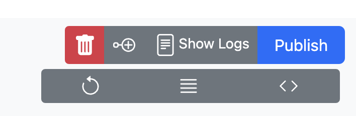

# Near DevHub indexers

This repo keeps track of DevHub's indexers. 
DevHub makes use of two custom indexers

1. The proposal [indexer](https://near.org/dataplatform.near/widget/QueryApi.App?selectedIndexerPath=thomasguntenaar.near/devhub_proposals_sierra)
2. The post [indexer](https://near.org/dataplatform.near/widget/QueryApi.App?selectedIndexerPath=bo.near/devhub_v38) (old feed)

## View

QueryAPI has a `QueryApi.App` [NEAR widget](https://near.org/dataplatform.near/widget/QueryApi.App), hosted under the dataplatform.near account. With this component, you can see all the public indexers currently available on the Near blockchain.

## Deploy

> [!IMPORTANT] 
> In order to deploy indexers your account needs to be given permission.

Simply fork an existing indexer and press the publish button in the [QueryApi.App](https://near.org/dataplatform.near/widget/QueryApi.App) widget.

Tips:

1. Once a indexer is deployed the schema can't be edited only forked. Make sure to deleted unused once.
You don’t have to fork the indexer every time you fix the JS code – this is needed only if you need to use another SQL schema or want to completely wipe the indexer. 

2. Make sure to fork the indexer before editing the schema. It automatically makes some useful changes for you.

3. The original way of writing data to the indexer was using GraphQL mutation. This generally works, but provides less flexibility and has poor performance. It is recommended to migrate to [context.db](https://docs.near.org/bos/queryapi/context-object#db-methods) methods. Try to use `upsert` extensively to allow your indexer to reindex same blocks.

Read more about the indexer in the [docs](https://docs.near.org/concepts/advanced/indexers)

Read more about [query api](https://docs.near.org/bos/queryapi/intro)

## Event Committee

On the event-committee side we tested on mainnet for while before wiping the contract state and redeploying/re-initializing the same contract. Which means you can NOT start the indexer at a random block. We found that  block [`118620288`](https://nearblocks.io/blocks/G8suDLFdavxz2aszhaKKtR59fh5ABq5j8pbN7YLxnREf) is a good start to not index the test proposals and still index proposal 0.
